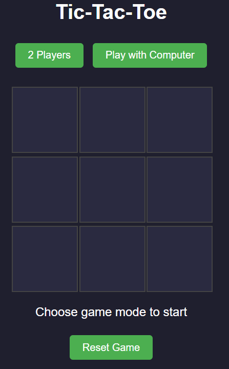

# 🎮 Tic-Tac-Toe Web Application

A fun and interactive Tic-Tac-Toe game built using **HTML**, **CSS**, and **JavaScript**. Users can play in two modes:
- **2 Players** (against a friend)
- **Play with Computer** (against a basic AI)

## 📸 Preview

### UI:

## 🚀 Features

- 🔘 Two Game Modes: Play against another player or a basic AI.
- 🔄 Reset Button to restart the game at any time.
- 🧠 AI: Random move generator (easy difficulty).
- ✅ Win & Draw detection with real-time status updates.
- 🎨 Clean, modern, and responsive UI.

## 🛠️ Technologies Used

- HTML5
- CSS3
- JavaScript (Vanilla)

## 📂 Project Structure
<pre>
tic-tac-toe/
├── index.html        # Main HTML structure
├── style.css         # Styling of the app
├── script.js         # Game logic
└── README.md         # Documentation
  </pre>

▶️ How to Run

i)Clone or download this repository.
ii)Open the index.html file in your browser.
iii)Choose a game mode and start playing!

🧠 Game Logic Overview

● The game board is a 3x3 grid.
● Players take turns placing X or O.
● The game checks for win or draw after every move.
● In Computer Mode, the AI makes a random valid move.
